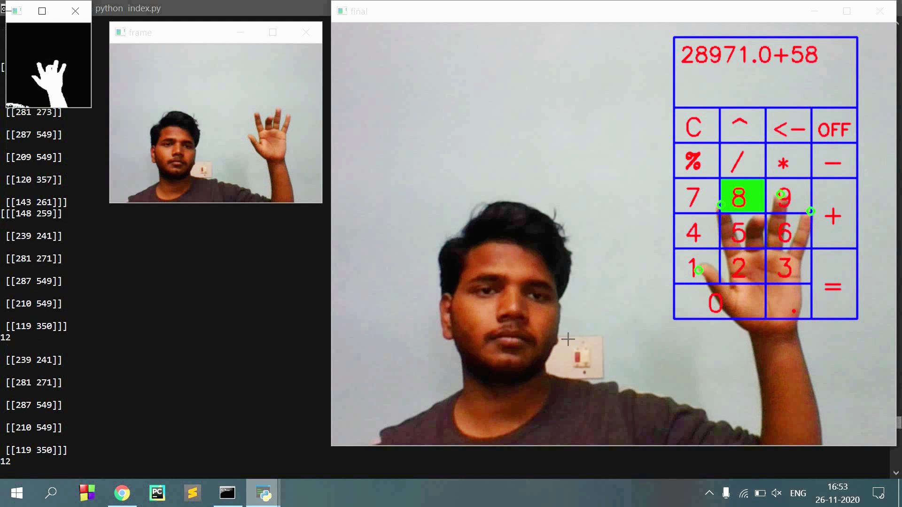

<h1 align="center"> Virtual-Calculator </h1>

<h3>Introduction</h3>

<strong>if you are curious about how tony stark(iron man) virtual computer work then here is a little approach toward it, I hope you will enjoy it.
 </strong>

In this project, I try to make a virtual calculator. when the code will execute it will use a webcam and show the video which it captures in addition to that it will also draw a virtual calculator on the output video. user needs to raise his hand and by using the index finger or middle finger or ring finger he/she click virtually on the calculator and can perform any operation he/she wants. the result will display on the display board in the top part of the calculator. it is recommended to use all your fingers for better performance but you can also try it with 3 or 4 fingers.

<a href="#"><strong>Youtube video for demonstration</strong></a><br>
<!-- <a href="#"></a> -->


<h3>Description of all files</h3>

<h5>index.py</h5>

it is a central file that uses other files function, output, etc, and makes the program run.

<h5>addon_function.py</h5>

It will contain all function which is used by index.py, use to organize the code


<h5>Set_HSV_values.py</h5>

When this code will run 3 windows are open, One will show normal video of input, 2nd window will show B&W video, and 3rd window will show 7 trackbars, you can play with the first 6 trackbars to get a good B&W video of yours in which your hand is properly distinctable. When it has done then close it. <br>
NOTE:- If you want to reset all values then click on the reset trackbar.

<h5>calc_size_position.py</h5>
this file is used to adjust calculator position and size by using trackbars.
note:- don't make a value of x less than 400 


<h5>data folder</h5>

this folder contains all numerical values used by the program. by these values, I try to make my code a little bit dynamic

hsv_values.txt -> it will store the HSV value which is used to remove the background from the video which is a capture.

values.txt -> it will store (x,y) coordinate if the top-left corner of calculator and height and width of a smallest block of the calculator.


<br>

<h3>required packages</h3>

```bash
- Python
- OpenCV-python
- Numpy
```
<br>


<h3>1 Getting Started</h3>


<h3>1.1 Installation</h3>

   
1. Clone this repository
   
```bash
git clone https://github.com/iTs-rd/Virtual-Calculator.git
```
   
2. Install the required packages
```bash
cd hand-gesture
pip install -r requirements.txt
```
<strong>If above code doesn't work replace pip by pip3.</strong><br>
It will install everything you need. If you have already installed some of the required packages it will skip that.

<h3>1.2 Run program</h3>

To run the program simply enter this line

```bash
python index.py
```

when you run index.py it will open 2 windows one is of your normal live video and the other is small in size which shows a video of your right half part and also in binary form.
if the smaller window will not removing your background properly or there is so much noise try to change your background by moving to another place or follow #1.3


<h3>1.3 Check your present condition </h3>

First of all, You have to check your hand is properly detected or not. by entering this command

```bash
python Set_HSV_values.py
```

It will open 3 windows, One will show normal video of input, 2nd window will show B&W video, and 3rd window will show 7 trackbars, you can play with the first 6 trackbars to get a good B&W video of yours in which your hand is properly distinctable. When it has done then close it.
<strong>Note:-</strong> If you wants to reset all values then click on reset trackbar.

<strong>If all done the program is ready to run</strong>


<h3>1.4 costimize calculator position</h3>

enter this command

```bash
python calc_size_position.py
```

it will open 2 windows one is your normal live video with calculator drawn on it and another window will contain 5 trackbars to change position, size of calculator note:- rest button is used to reset calculator position.


<h3>summary</h3>

Run these code line by line

```bash
git clone https://github.com/iTs-rd/hand-gesture.git
cd hand-gesture
pip install -r requirements.txt
python index.py
```

<h3>Contacts</h3>
Email- Rudresh.gupta.che19@iitbhu.ac.in <br>
Linkedin- https://www.linkedin.com/in/rudresh-gupta-b87a84190
